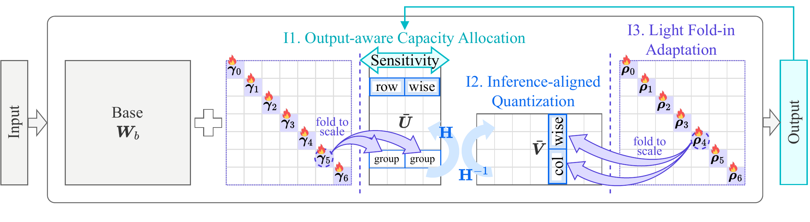

#  ADE: Accurate, Inference-efficient, and Tunable Delta Compression for Task-specific Fine-tuned Foundation Models

This project is a PyTorch implementation of **"ADE: Accurate, Inference-efficient, and Tunable Delta Compression for Task-specific Fine-tuned Foundation Models"** (anonymous submission).

Given multiple task-specific fine-tuned models with the same base, how can we deploy them compactly while preserving each model's performance?
ADE (**A**ccurate **D**elta compression with **E**fficient inference) stores only the difference (delta) between each aligned model and its backbone, and compresses it with three ideas: it allocates capacity by the sensitivity of each module's output including the base weights, it quantizes the delta along the direction of matrix multiplication for fast low-bit inference, and it supports near-zero-overhead tuning on the compressed delta.
This repository implements the main experiment of the paper (Table 1): six aligned models compressed to a ratio of α = 1/16, without (ADE<sub>-L</sub>) and with (ADE) light fold-in adaptation.

## Overview



ADE compresses the weight matrix ΔW = W<sub>a</sub> − W<sub>b</sub> of every linear module of the delta with a truncated SVD and uniform 4-bit quantization (Algorithm 1 of the paper):

1. **Output-aware capacity allocation (I1, Section 3.2).**
   The sensitivity S(W<sub>a</sub>) of each module (eq. 4) is the output drift ‖W<sub>a</sub>X − (W<sub>b</sub> + ΔW<sub>r̃</sub>)X‖²<sub>F</sub> / ‖W<sub>a</sub>X‖²<sub>F</sub> on calibration activations X, measured at the probe rank r̃ of uniform allocation (eq. 13).
   Every module receives R<sub>min</sub> ranks and the remaining bit budget is shared in proportion to the sensitivity (eqs. 11-12).
   A rank costs c<sub>l</sub> = (b<sub>quant</sub> + (b<sub>s</sub> + b<sub>z</sub>)/G)(d<sub>o</sub> + d<sub>i</sub>) bits, so the 4-bit codes, the 16-bit scales, and the 4-bit zero-points of the compressed delta together never exceed α of the original weights.
2. **Inference-aligned quantization (I2, Section 3.3).**
   Σ<sup>1/2</sup> is absorbed into both SVD factors, a shared orthogonal rotation H (the normalized Sylvester Hadamard matrix when the rank is a power of two, a seeded random orthogonal matrix otherwise) flattens them, and Q<sub>r</sub>(UΣ<sup>1/2</sup>H) and Q<sub>c</sub>(H<sup>T</sup>Σ<sup>1/2</sup>V<sup>T</sup>) quantize them row- and column-wise in groups of G = 128 along the rank axis (eq. 5), so that the product ÛV̂<sup>T</sup> can be computed in low-bit arithmetic with one rescaling per group (eq. 7).
3. **Light fold-in adaptation (I3, Section 3.4).**
   Two vectors per module, γ ∈ R<sup>d<sub>o</sub></sup> for the rows of Û and ρ ∈ R<sup>d<sub>i</sub></sup> for the columns of V̂<sup>T</sup> (eq. 9), are trained with λ<sub>LM</sub>L<sub>LM</sub> + λ<sub>KD</sub>L<sub>KD</sub> + λ<sub>RE</sub>L<sub>RE</sub> against the aligned model (eq. 20) and folded into the per-group scales afterwards (eq. 10), so the adapted delta keeps the same size and inference path.

The compressed delta is evaluated the way it is served (Section 3.3.1, Appendix K): the base weights stay dense and the delta is applied at every forward pass with ADE's two CUDA kernels, which read the same packed 4-bit codes.
A forward pass over T ≤ 128 tokens uses factored application W<sub>b</sub>X + Û(V̂<sup>T</sup>X) with the packed INT4 decode kernels, and a longer one uses reconstructed application (W<sub>b</sub> + ÛV̂<sup>T</sup>)X with the INT4 Tensor Core reconstruction kernel (INT32 accumulation, one FP32 rescaling per group, eq. 7).
The benchmarks are generated with Hugging Face `generate` and greedy decoding.

## Prerequisites

Our implementation is based on PyTorch, Hugging Face Transformers, and EvalPlus.
We used the following versions (Python 3.10, CUDA 12.6):

- torch 2.7.0
- transformers 4.53.2
- datasets 3.6.0
- accelerate 1.14.0
- evalplus 0.3.1
- ninja 1.13.2 (building the CUDA kernels)
- huggingface_hub 0.36.2, safetensors 0.8.0, sentencepiece 0.2.2, protobuf 5.29.6, pyyaml 6.0.3, tqdm 4.70.1, numpy 2.2.6, Pillow 12.3.0

```shell
pip install -r requirements.txt
```

**CUDA kernels.**
ADE's CUDA kernels are compiled on first use and require `nvcc` (CUDA 12.x) and `ninja`.
The INT4 Tensor Core kernel requires an Ampere or Ada GPU (compute capability 8.x, e.g., A100); on other GPUs, the code falls back to a PyTorch implementation.

## Datasets

All datasets are downloaded from the Hugging Face Hub (or by EvalPlus) on first use.

| Purpose | Domain | Dataset | Source |
|---|---|---|---|
| Calibration and fold-in training | Math | MetaMathQA | [meta-math/MetaMathQA](https://huggingface.co/datasets/meta-math/MetaMathQA) |
| Calibration and fold-in training | Code | Magicoder OSS-Instruct-75K + Evol-Instruct-110K | [ise-uiuc/Magicoder-OSS-Instruct-75K](https://huggingface.co/datasets/ise-uiuc/Magicoder-OSS-Instruct-75K), [ise-uiuc/Magicoder-Evol-Instruct-110K](https://huggingface.co/datasets/ise-uiuc/Magicoder-Evol-Instruct-110K) |
| Calibration and fold-in training | Multi-modal | Alpaca (cleaned) | [yahma/alpaca-cleaned](https://huggingface.co/datasets/yahma/alpaca-cleaned) |
| Evaluation | Math | GSM8K (test, 1,319 problems) | [openai/gsm8k](https://huggingface.co/datasets/openai/gsm8k) |
| Evaluation | Code | MBPP from EvalPlus (378 problems, base tests) | [EvalPlus](https://github.com/evalplus/evalplus) (`evalplus.data.get_mbpp_plus`) |
| Evaluation | Multi-modal | TextVQA (validation, 5,000 questions) | [lmms-lab/textvqa](https://huggingface.co/datasets/lmms-lab/textvqa) |

## Models

Backbone and aligned models of Table 1 (Table 6 of the paper).

| Task | Base model | Aligned model | Benchmark |
|---|---|---|---|
| Math | [Llama-2-7B](https://huggingface.co/meta-llama/Llama-2-7b-hf) | [WizardMath-7B-V1.0](https://huggingface.co/WizardLMTeam/WizardMath-7B-V1.0) | GSM8K |
| Math | [Llama-2-13B](https://huggingface.co/meta-llama/Llama-2-13b-hf) | [WizardMath-13B-V1.0](https://huggingface.co/WizardLMTeam/WizardMath-13B-V1.0) | GSM8K |
| Code | [CodeLlama-Python-7B](https://huggingface.co/codellama/CodeLlama-7b-Python-hf) | [MagicoderS-CL-7B](https://huggingface.co/ise-uiuc/Magicoder-S-CL-7B) | MBPP |
| Code | [CodeLlama-Python-13B](https://huggingface.co/codellama/CodeLlama-13b-Python-hf) | [WizardCoder-Python-13B-V1.0](https://huggingface.co/WizardLMTeam/WizardCoder-Python-13B-V1.0) | MBPP |
| Multi-modal | [Vicuna-v1.5-7B](https://huggingface.co/lmsys/vicuna-7b-v1.5) | [LLaVA-v1.5-7B](https://huggingface.co/liuhaotian/llava-v1.5-7b) ([llava-hf](https://huggingface.co/llava-hf/llava-1.5-7b-hf)) | TextVQA |
| Multi-modal | [Vicuna-v1.5-13B](https://huggingface.co/lmsys/vicuna-13b-v1.5) | [LLaVA-v1.5-13B](https://huggingface.co/liuhaotian/llava-v1.5-13b) ([llava-hf](https://huggingface.co/llava-hf/llava-1.5-13b-hf)) | TextVQA |

Models are resolved by name: a directory `$ADE_MODEL_ROOT/<name>` (e.g. `$ADE_MODEL_ROOT/Llama-2-7b-hf`) is used when it exists, and the Hugging Face repository is downloaded otherwise.
For LLaVA-v1.5, the aligned model that is compressed is its language model: on the first run, `$ADE_MODEL_ROOT/llava-v1.5-7b-lm` is created from the LLaVA checkpoint (language-model weights) and Vicuna-v1.5 (configuration and tokenizer, which LLaVA-v1.5 shares).
For evaluation, the llava-hf checkpoint provides the vision tower, the projector, and the processor.

## Usage

### Demo

`run.sh` compresses one model (default: MagicoderS-CL-7B) at α = 1/16 without and with light fold-in adaptation and evaluates both:

```shell
export ADE_MODEL_ROOT=/path/to/models      # optional; models are downloaded otherwise
bash run.sh                                # MagicoderS-CL-7B
bash run.sh wizardmath-7b                  # any model of configs/
```

### Running a configuration

```shell
# ADE_-L: output-aware capacity allocation + inference-aligned quantization
python src/main.py --config configs/wizardmath-7b_untuned.yaml --output_dir outputs/wizardmath-7b_untuned

# ADE: + light fold-in adaptation
python src/main.py --config configs/wizardmath-7b.yaml --output_dir outputs/wizardmath-7b

# evaluate an existing compressed delta again (no recompression)
python src/main.py --config configs/wizardmath-7b.yaml --output_dir outputs/wizardmath-7b \
    --delta outputs/wizardmath-7b/tuned.pt
```

A run writes to `--output_dir`:

| File | Content |
|---|---|
| `config.yaml` | the configuration of the run |
| `compressed.pt` | ADE<sub>-L</sub>: packed INT4 codes, 16-bit scales, and INT4 zero-points of every module |
| `tuned.pt` | ADE: the same after light fold-in adaptation (γ and ρ folded into the scales) |
| `eval/summary.json` | benchmark score (GSM8K accuracy, MBPP pass@1, or TextVQA accuracy) |

The SVD factors and sensitivities of stage 1 are cached in `$ADE_CACHE_DIR` (default `./cache/stage1`) and reused by later runs of the same model and calibration data, e.g. by the tuned configuration after the untuned one.

Options of `src/main.py`:

| Option | Meaning |
|---|---|
| `--alpha` | target compression ratio (overrides `alpha` of the configuration) |
| `--alloc_kappa` | exponent κ of the rank allocation (overrides `alloc_kappa`; 1 = the rule of the paper) |
| `--bits`, `--group_size`, `--scale_bits`, `--zero_bits` | b<sub>quant</sub> = 4, G = 128, b<sub>s</sub> = 16, b<sub>z</sub> = b<sub>quant</sub> (the storage cost of a rank) |
| `--decode_max_tokens` | largest number of tokens per forward pass that uses factored application (default 128) |
| `--split_k` | allow split-K launch plans for the decode kernels (faster, not bitwise reproducible) |
| `--delta` | evaluate an existing `compressed.pt` / `tuned.pt` instead of compressing again |
| `--teacher_device cuda:1` | aligned (teacher) model on a second GPU during adaptation |
| `--grad_ckpt` | gradient checkpointing during adaptation |
| `--eval_limit N` | evaluate only the first N items (quick checks; GSM8K and TextVQA) |
| `--skip_eval` | stop after writing the compressed delta |

### Configurations

`configs/` contains the configurations of Table 1 (α = 1/16):

| Model | ADE<sub>-L</sub> (untuned) | ADE (tuned) |
|---|---|---|
| WizardMath-7B-V1.0 | `wizardmath-7b_untuned.yaml` | `wizardmath-7b.yaml` |
| WizardMath-13B-V1.0 | `wizardmath-13b_untuned.yaml` | `wizardmath-13b.yaml` |
| MagicoderS-CL-7B | `magicoder-7b_untuned.yaml` | `magicoder-7b.yaml` |
| WizardCoder-Python-13B-V1.0 | `wizardcoder-13b_untuned.yaml` | `wizardcoder-13b.yaml` |
| LLaVA-v1.5-7B | `llava-7b_untuned.yaml` | `llava-7b.yaml` |
| LLaVA-v1.5-13B | `llava-13b_untuned.yaml` | `llava-13b.yaml` |

Configuration keys: `task` (math, code, multimodal), `base_model`, `aligned_model`, `llava_hf_model` (LLaVA only), `alpha`, `calib_dataset`, `r_min` (R<sub>min</sub>, a multiple of G), `alloc_kappa` (the rank share beyond R<sub>min</sub> is proportional to S<sup>κ</sup>; κ = 1 is the rule of the paper), and for light fold-in adaptation `epochs` (0 = ADE<sub>-L</sub>), `train_data`, `num_train_samples`, `learning_rate`, `weight_decay`, `warmup_ratio`, `max_grad_norm`, `batch_size`, `grad_accum`, `lambda_lm`, `lambda_kd`, `lambda_re`, and `kd_reduction` (L<sub>KD</sub> summed over the sequence, `batchmean`, or averaged per token, `tokenmean`).

## Code Description

```
ADE/
├── README.md
├── requirements.txt
├── run.sh                    # demo: untuned and tuned ADE on one model
├── assets/                   # overview figure and logo
├── configs/                  # Table 1 configurations (alpha = 1/16)
├── src/
│   ├── main.py               # pipeline: allocation, quantization, adaptation, evaluation
│   ├── allocation.py         # I1: input covariances, probe rank, sensitivity, rank allocation
│   ├── quantization.py       # I2: rotation H, Q_r / Q_c, packed factors, low-bit reconstruction (eq. 7)
│   ├── adaptation.py         # I3: fold-in modules (gamma, rho), training objective, folding into scales
│   ├── kernels.py            # CUDA kernels: INT4 Tensor Core reconstruction, packed INT4 decode
│   ├── serving.py            # evaluation model: linear modules that apply the delta with the kernels
│   ├── evaluate.py           # GSM8K, MBPP (EvalPlus), TextVQA
│   ├── data.py               # calibration and fold-in training data
│   ├── models.py             # model resolution, language model of LLaVA-1.5
│   └── utils.py              # arguments, configurations, packed-delta files
```
